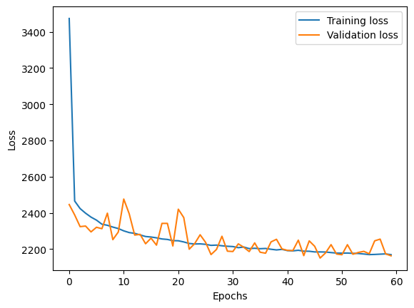

# Predictive Maintenance Project

This project aims to predict the Remaining Useful Life (RUL) of engines using a neural network model. The project involves data preprocessing, model training, and evaluation based on a specified asymmetric scoring function. I've made it as a part of my project internship at iNeuron Technologies. 

## Table of Contents

- [Installation](#installation)
- [Model Inference](#model-inference)
- [Project Structure](#project-structure)
- [Data Preprocessing](#data-preprocessing)
- [Model Training and Evaluation](#model-training-and-evaluation)
- [Contributing](#contributing)
- [License](#license)

## Installation

1. **Clone the repository**:
    ```bash
    git clone https://github.com/vardanskamra/predictive_maintenance_project
    cd predictive_maintenance_project
    ```

2. **Create a virtual environment**:
    ```bash
    python -m venv venv
    ```

    On macOS/Linux:
    ```bash
    source venv/bin/activate
    ``` 

    On Windows:
    ```bash
    venv\Scripts\activate
    ```

3. **Install dependencies**:
    ```bash
    pip install -r requirements.txt
    ```
    or
    ```bash
    pip install .

## Model Inference

1.  **Activate the virtual environment**:
    ```bash
    On macOS/Linux:
    source venv/bin/activate  

    On Windows:
    venv\Scripts\activate
    ```

2. **Add your inference data paths to main.py**:

    Replace the ```app/inference_data.csv``` with path to your data, it must be in the same format as ```inference_data.csv```
    ```python
    .
    .
    df = load_data('app/inference_data.csv') # add your path to data
    .
    .
    np.savetxt('app/inference_prediction.txt', y_pred, fmt = '%f') # add your path for predictions file
    .
    .
    ```

3. **Run the inference script**:
    ```bash
    python ./app/main.py
    ```
    Check ```logs/inference.log``` for any errors

## Project Structure

```bash
predictive_maintainace_project/
│
├── app/
│   ├── models/
│   │   ├── rul_model.keras
│   │   └── scaler.pkl
│   ├── __init__.py
│   ├── preprocessing.py
│   ├── logging_config.py
│   ├── main.py
│   ├── inference_data.csv
│   ├── inference_prediction.txt
│   └── model_building.ipynb
│ 
│ 
├── logs/
│   ├── inference.log
│   └── model_building.log
├── tests/
│   ├── __init__.py
│   ├── test_preprocessing.py
│   └── test_preprocessing.csv
│ 
├── .gitignore
├── setup.py
├── eda_preprocessing.ipynb
├── requirements.txt
├── LICENSE.txt
└── README.md

```

## Data Preprocessing
Initial data preprocessing was done in ```eda_preprocessing.ipynb```, while ```preprocessing.py``` handles standardiazation and loading of the data.

```preprocessing.load_data(file_path)``` handles the loading part.

```standardize(df, scaler_params=None, save_path=None)``` manages the standardization part, it also saves the scaler ```models/scaler.pkl``` for future use while inferenceing.

```tests/test_preprocessing.py``` is the unit test for the preprocessing module.

## Model Training and Evaluation

Model training and evaluation is done in ```app/model_building.ipynb``` 

The model is a fully connected neural neural network with 3 hidden relu layers:
```python
model=Sequential([
        Input(shape=(25,)),
        Dense(100, activation = 'relu', kernel_regularizer = l2(0.01)),
        Dense(50, activation = 'relu', kernel_regularizer = l2(0.01)),
        Dense(25, activation = 'relu', kernel_regularizer = l2(0.01)),
        Dense(1, activation = 'linear', kernel_regularizer = l2(0.01))
    ])

model.compile(optimizer='adam', loss='mse')
```

The model explains about 70% of the variance in the data. On average the predictions are off by about 30 units (RUL cycles). 



On test data:
```python
MAE: 32.340507093454804
MSE: 2135.105718950797
R2 Score: 0.6940486431121826
```

The model shows a reasonable fit with an R² score of 0.69, but the MAE and MSE suggest there is room for improvement. However, the baseline performance is not high either, making it a reasonable model.

## Contributing

Contributions are welcome! Please open an issue or submit a pull request for any improvements.
### Coding Standards

Please adhere to the following coding standards when contributing to this project:
- Follow PEP 8 guidelines for Python code.
- Write clear and concise commit messages.
- Include comments and docstrings to explain your code.
- Ensure your code is well-tested.

## License

This project is licensed under the MIT License - see the [LICENSE](LICENSE.txt) file for details.